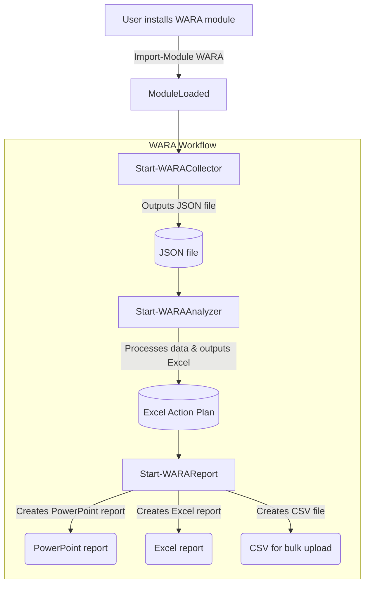

[](https://github.com/Azure/Well-Architected-Reliability-Assessment/actions/workflows/pestertests.yml)
[](https://github.com/Azure/Well-Architected-Reliability-Assessment/actions/workflows/powershell.yml)

> [!NOTE]
> This repository is for the development of the WARA tooling. The up to date documentation for the module commands can be found [here](https://azure.github.io/Azure-Proactive-Resiliency-Library-v2/tools/).

# Well-Architected-Reliability-Assessment

The Well-Architected Reliability Assessment is aimed to assess an Azure workload implementation across the reliability pillar of the Microsoft Azure Well-Architected Framework. A workload is a resource or collection of resources that provide end-to-end functionality to one or multiple clients (humans or systems). An application can have multiple workloads, with multiple APIs and databases working together to deliver specific functionality.

The main goal of the Well-Architected Reliability Assessment is to provide an in-depth and comprehensive end-to-end Architecture and Resources review of an existing Workload to identify critical reliability, resiliency, availability, and recovery risks to the scoped workload on Azure.

This repository holds scripts and automation built for the Well-Architected Reliability Assessment and is currently under development.

## Table of Contents

- [Patch Notes](#patch-notes)
- [Getting Started](#getting-started)
  - [Quick Workflow Example](#quick-workflow-example)
- [Requirements](#requirements)
- [Quick Starts](#quick-starts)
  - [Start-WARACollector](#start-waracollector)
  - [Start-WARAAnalyzer](#start-waraanalyzer)
  - [Start-WARAReport](#start-warareport)
- [Project Structure](#project-structure)
- [Modules](#modules)

## Getting Started

### Patch Notes

See [Releases](https://github.com/Azure/Well-Architected-Reliability-Assessment/releases) for the latest patch notes.

### WARA Module Flow Architecture



### Quick Workflow Example

```PowerShell
# Assume we running from a C:\WARA directory

# Installs the WARA module from the PowerShell Gallery.
Install-Module WARA

# Imports the WARA module to the PowerShell session.
Import-Module WARA

# Start the WARA collector.
Start-WARACollector -TenantID "00000000-0000-0000-0000-000000000000" -SubscriptionIds "/subscriptions/00000000-0000-0000-0000-000000000000"

# Assume output from collector is 'C:\WARA\WARA_File_2024-04-01_10_01.json'
Start-WARAAnalyzer -JSONFile 'C:\WARA\WARA_File_2024-04-01_10_01.json'

# This needs to be run on a Windows machine with PowerPoint installed.
# Assume output from analyzer is 'C:\WARA\Expert-Analysis-v1-2025-02-04-11-14.xlsx'
Start-WARAReport -ExpertAnalysisFile 'C:\WARA\Expert-Analysis-v1-2025-02-04-11-14.xlsx'

#You will now have your PowerPoint and Excel reports generated under the C:\WARA directory.
```

## Requirements

> [!IMPORTANT]
> These are the requirements for the collector. Requirements for all commands can be found [here](https://azure.github.io/Azure-Proactive-Resiliency-Library-v2/tools/) in the tools section of the Azure Proactive Resiliency Library.

- [PowerShell 7.4](https://learn.microsoft.com/powershell/scripting/install/installing-powershell)
- Azure PowerShell Module
  - If you don't have the Azure PowerShell module installed, you can install it by running the following command:

    ```powershell
    Install-Module -Name Az
     ```

  - If you have the Azure PowerShell module installed, you can update it by running the following command:

    ```powershell
    Update-Module -Name Az
    ```

- Az.Accounts PowerShell Module 3.0 or later
  - If you don't have the Az.Accounts module installed, you can install it by running the following command:

    ```powershell
    Install-Module -Name Az.Accounts
    ```

  - If you have the Az.Accounts module installed, you can update it by running the following command:

    ```powershell
    Update-Module -Name Az.Accounts
    ```

- Az.ResourceGraph PowerShell Module 1.0 or later
  - If you don't have the Az.ResourceGraph module installed, you can install it by running the following command:

    ```powershell
    Install-Module -Name Az.ResourceGraph
    ```

  - If you have the Az.ResourceGraph module installed, you can update it by running the following command:

    ```powershell
    Update-Module -Name Az.ResourceGraph
    ```

## Quick Starts

### Start-WARACollector

These instructions are the same for any platform that supports PowerShell. The following instructions have been tested on Azure Cloud Shell, Windows, and Linux.

You can review all of the parameters on the Start-WARACollector [here](docs/wara/Start-WARACollector.md).

> [!NOTE]
> Whatever directory you run the `Start-WARACollector` cmdlet in, the Excel file will be created in that directory. For example: if you run the `Start-WARACollector` cmdlet in the `C:\Temp` directory, the Excel file will be created in the `C:\Temp` directory.

1. Install the WARA module from the PowerShell Gallery.

```powershell
# Installs the WARA module from the PowerShell Gallery.
Install-Module WARA
```

2. Import the WARA module.

```powershell
# Import the WARA module.
Import-Module WARA
```

3. Start the WARA collector. (Replace these values with your own)

```powershell
# Start the WARA collector.
Start-WARACollector -TenantID "00000000-0000-0000-0000-000000000000" -SubscriptionIds "/subscriptions/00000000-0000-0000-0000-000000000000"
```

### Examples

#### Run the collector against a specific subscription

```PowerShell
Start-WARACollector -TenantID "00000000-0000-0000-0000-000000000000" -SubscriptionIds "/subscriptions/00000000-0000-0000-0000-000000000000"
```

#### Run the collector against a multiple specific subscriptions

```PowerShell
Start-WARACollector -TenantID "00000000-0000-0000-0000-000000000000" -SubscriptionIds @("/subscriptions/00000000-0000-0000-0000-000000000000","/subscriptions/00000000-0000-0000-0000-000000000001")
```

#### Run the collector against a specific subscription and resource group

```PowerShell
Start-WARACollector -TenantID "00000000-0000-0000-0000-000000000000" -SubscriptionIds "/subscriptions/00000000-0000-0000-0000-000000000000" -ResourceGroups "/subscriptions/00000000-0000-0000-0000-000000000000/resourceGroups/RG-001"
```

#### Run the collector against a specific subscription and resource group and filtering by tag key/values

```PowerShell
Start-WARACollector -TenantID "00000000-0000-0000-0000-000000000000" -SubscriptionIds "/subscriptions/00000000-0000-0000-0000-000000000000" -ResourceGroups "/subscriptions/00000000-0000-0000-0000-000000000000/resourceGroups/RG-001" -Tags "Env||Environment!~Dev||QA" -AVD -SAP -HPC
```

#### Run the collector against a specific subscription and resource group, filtering by tag key/values and using the specialized resource types (AVD, SAP, HPC, AVS)

```PowerShell
Start-WARACollector -TenantID "00000000-0000-0000-0000-000000000000" -SubscriptionIds "/subscriptions/00000000-0000-0000-0000-000000000000" -ResourceGroups "/subscriptions/00000000-0000-0000-0000-000000000000/resourceGroups/RG-001" -Tags "Env||Environment!~Dev||QA" -AVD -SAP -HPC
```

#### Run the collector using a configuration file

```PowerShell
Start-WARACollector -ConfigFile "C:\path\to\config.txt"
```

#### Run the collector using a configuration file and using the specialized resource types (AVD, SAP, HPC, AVS)

```PowerShell
Start-WARACollector -ConfigFile "C:\path\to\config.txt" -SAP -AVD
```

### Start-WARAAnalyzer

The `Start-WARAAnalyzer` cmdlet is used to analyze the collected data and generate the core WARA Action Plan Excel file.

> [!NOTE]
> Whatever directory you run the `Start-WARAAnalyzer` cmdlet in, the Excel file will be created in that directory. For example: if you run the `Start-WARAAnalyzer` cmdlet in the `C:\Temp` directory, the Excel file will be created in the `C:\Temp` directory.

You can review all of the parameters of Start-WARAAnalyzer [here](docs/wara/Start-WARAAnalyzer.md).

#### Examples

##### Run the analyzer against a specific JSON file

```PowerShell
Start-WARAAnalyzer -JSONFile 'C:\WARA\WARA_File_2024-04-01_10_01.json'
```

### Start-WARAReport

The `Start-WARAReport` cmdlet is used to generate the WARA reports.

> [!NOTE]
> Whatever directory you run the `Start-WARAReport` cmdlet in, the Excel and PowerPoint files will be created in that directory. For example: if you run the `Start-WARAReport` cmdlet in the `C:\Temp` directory, the Excel and PowerPoint files will be created in the `C:\Temp` directory.

You can review all of the parameters of Start-WARAReport [here](docs/wara/Start-WARAReport.md).

#### Examples

##### Create the Excel and PowerPoint reports from the Action Plan Excel output

```PowerShell
Start-WARAReport -ExpertAnalysisFile 'C:\WARA\Expert-Analysis-v1-2025-02-04-11-14.xlsx'
```

## Project Structure

This repository is meant to be used for the development of the Well-Architected Reliability Assessment automation. This project uses outputs from the Azure Well-Architected Framework and Azure Advisor to provide insights into the reliability of an Azure workload.

## Modules

- [🔍wara](docs/wara/wara.md)
- [🎗️advisor](docs/advisor/advisor.md)
- [📦collector](docs/collector/collector.md)
- [🌩️outage](docs/outage/outage.md)
- [🏖️retirement](docs/retirement/retirement.md)
- [🔬scope](docs/scope/scope.md)
- [🏥servicehealth](docs/servicehealth/servicehealth.md)
- [🩹support](docs/support/support.md)
- [🔧utils](docs/utils/utils.md)
