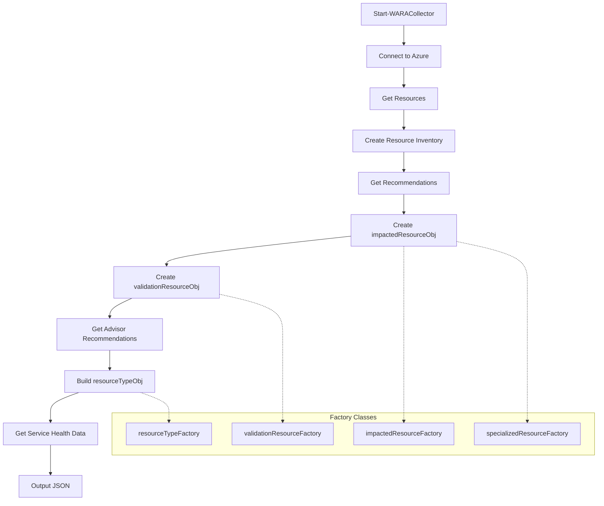

# WARA Module

## Description

This module contains the functions and classes required for the Well Architected Reliability Review Automation (WARA) project.

## WARA Cmdlets

### [Start-WARACollector](Start-WARACollector.md)

This is the main cmdlet that starts the WARA collector. It collects the data from a variety of sources and exports it to a json file.

### [Start-WARAAnalyzer](Start-WARAAnalyzer.md)

This is the main cmdlet that starts the WARA analyzer. It processes the json file created by the `Start-WARACollector` function and creates the core WARA Action Plan Excel file.

### [Start-WARAReport](Start-WARAReport.md)

This is the main cmdlet that starts the WARA report. It processes the json file created by the `Start-WARACollector` function and creates the report documentation.

## WARA Classes

- [aprlResourceTypeObj](wara-module-classes.md#aprlresourcetypeobj) - Resource type object representing Azure resources
- [resourceTypeFactory](wara-module-classes.md#resourcetypefactory) - Factory for creating resource type objects
- [aprlResourceObj](wara-module-classes.md#aprlresourceobj) - Resource object representing individual Azure resources
- [impactedResourceFactory](wara-module-classes.md#impactedresourcefactory) - Factory for creating impacted resource objects
- [validationResourceFactory](wara-module-classes.md#validationresourcefactory) - Factory for creating validation resource objects
- [specializedResourceFactory](wara-module-classes.md#specializedresourcefactory) - Factory for creating specialized resource objects

### [WARA Module Classes](wara-module-classes.md)

Detailed documentation of the classes used within the WARA module, including their purpose, properties, constructors, methods, and usage examples.

## Flow Diagram

The following diagram illustrates the high-level flow of the WARA Collector process.

